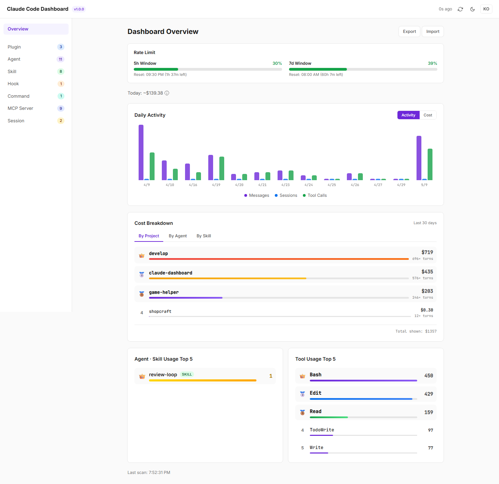
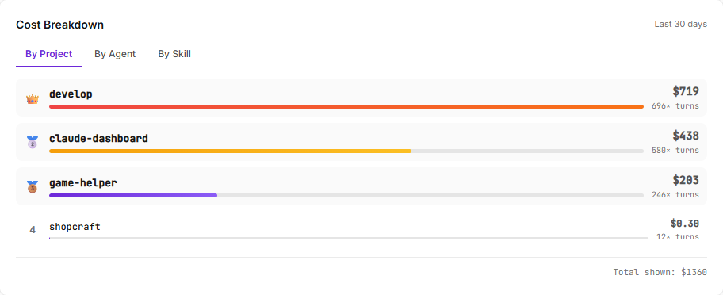
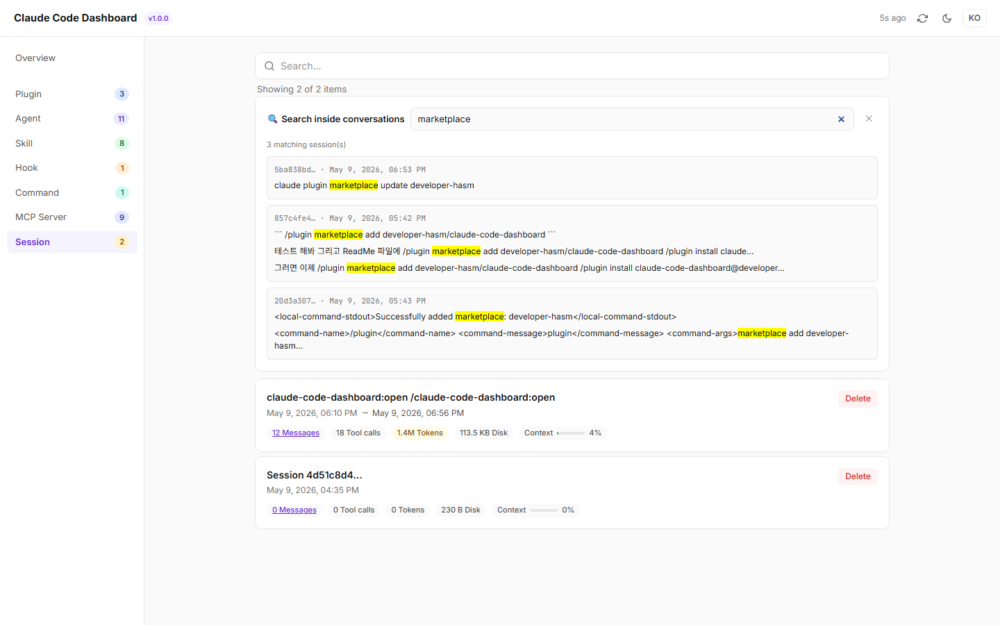
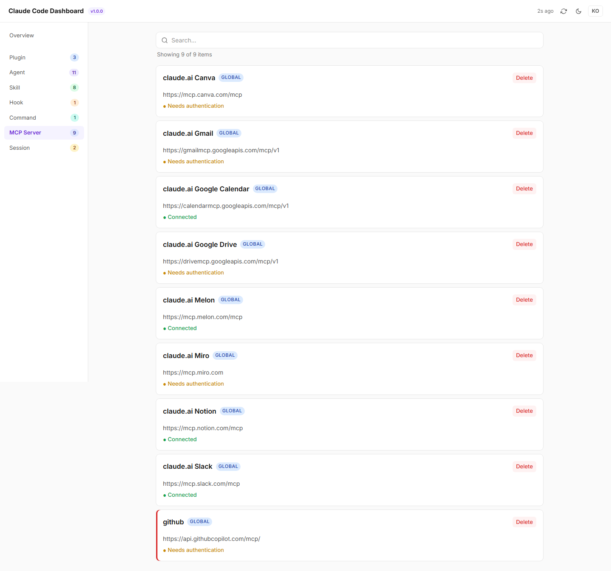

# Claude Code Dashboard

> Local web dashboard for [Claude Code](https://docs.claude.com/en/docs/claude-code) — monitor rate limits, manage agents/skills/hooks/MCP servers, browse session history, track daily activity and usage rankings.




## Screenshots

| Cost Breakdown by project / agent / skill | Full-text session search |
|--------------------------------------------|---------------------------|
|  |  |

<details>
<summary>More — MCP servers and other category pages</summary>



</details>

## Features

### Overview

- **Rate Limit Monitor** — Real-time 5h / 7d window usage from Anthropic OAuth API
- **Cost Estimator** — Today's API-equivalent cost by model (Opus / Sonnet / Haiku)
- **Daily Activity Chart** — Per-day messages, sessions, tool calls (Activity / Cost toggle)
- **Top 5 Rankings** — Most-used agents, skills, and tools (with crown badges)
- **Missing Required Items** — Detects skills referenced by agents but not installed

### Inventory Management

| Category | Source |
|----------|--------|
| Plugin | `installed_plugins.json` + marketplace `plugin.json` |
| Agent | `.claude/agents/*.md` (frontmatter parsed) |
| Skill | `.claude/skills/*/SKILL.md` |
| Hook | `settings.json` hooks section |
| Command | `.claude/commands/*.md` |
| MCP Server | `claude mcp list` CLI output |
| Session | `sessions/*.json` + JSONL transcripts |

Each item card shows: name, scope (PROJECT/GLOBAL), description, created/last-used dates, delete button.
Sort order: last used DESC → created DESC → name ASC.
Delete shows dependency warnings (bidirectional dependents/dependencies).

### Session Browser

- Session cards with first prompt, token counts, cost, context saturation
- "Messages" click → full conversation modal
- Scheduled-task badges, start/end times

### v1.1 — SQLite Incremental Scanner

- `better-sqlite3` with WAL mode
- Incremental scan via `mtime` + `file_size` comparison — only new lines parsed
- `message_id`-based deduplication (UPSERT)
- Per-model cost estimation stored in `turns.cost_usd`
- Schema migration framework

### UX

- Dark mode, EN/KO i18n
- Responsive layout (768px breakpoint)
- Vercel-style design (CSS custom properties)

## Quick Start

### Prerequisites

- Node.js ≥ 20
- [Claude Code CLI](https://docs.claude.com/en/docs/claude-code) installed

### Install via Claude Code Plugin Marketplace (recommended)

Inside Claude Code, run:

```
/plugin marketplace add developer-hasm/claude-code-dashboard
/plugin install claude-code-dashboard@developer-hasm
```

Then use these slash commands inside Claude Code:

| Command | Description |
|---------|-------------|
| `/claude-code-dashboard:open` | Open the dashboard in the browser (starts the server if not running). Idempotent. On cold start (server not already up) it also checks for new releases — best-effort, silent on network failure. |
| `/claude-code-dashboard:stop` | Stop the running dashboard server |
| `/claude-code-dashboard:status` | Show running status, PID, port, uptime |
| `/claude-code-dashboard:update` | Pull the latest released version via the marketplace, stop the running server, and print restart instructions |

The first `:open` will run `npm install` and `npm run build` in the plugin's install directory (one-time, ~1 minute), then launch the server and open your browser. Subsequent invocations just refocus the existing dashboard.

### Updating

On cold start, `:open` prints a notice when a newer release is available (the exact wording is in `commands/open.md`):

```
📦 Update available: 1.0.0 → 1.1.0
   To update, run /claude-code-dashboard:update
   (this dashboard will keep working on the current version until you do)
```

The check only runs on cold start (when `:open` actually launches the server) and is best-effort — silent on network failure. When the server is already running, `:open` skips the version check entirely to keep re-open sub-second.

`:update` runs `claude plugin marketplace update` + `claude plugin update`, stops the current server gracefully (with a forced fallback after 2s), and tells you to restart Claude Code so the new slash commands and install path are picked up.

### Install from source

```bash
git clone https://github.com/developer-hasm/claude-code-dashboard.git
cd claude-code-dashboard
npm install
npm run build
npm start
```

The dashboard auto-opens at `http://127.0.0.1:19280` (port range 19280–19289).

### Usage

The server walks up from the current working directory to find a `.claude/` folder. Run `npm start` from inside (or above) your Claude Code project to see its inventory.

```bash
cd /path/to/your/project    # has .claude/ subfolder
npm start --prefix /path/to/claude-code-dashboard
```

CLI flags:
- `--no-open` — don't auto-launch browser

## Tech Stack

- **Framework**: Next.js 15 (standalone), React 19, TypeScript 5
- **Styling**: Tailwind CSS v4 (CSS custom properties)
- **Database**: better-sqlite3 (WAL mode)
- **Parsing**: gray-matter (YAML frontmatter)
- **Testing**: Playwright (25 E2E tests)

## Architecture

```
server.mjs                  → singleton/PID + port allocation + Next standalone fork
src/app/api/*/route.ts      → REST endpoints (inventory, health, token, sessions, ...)
src/lib/scanner.ts          → category scanners (agents, skills, hooks, MCP, etc.)
src/lib/incremental-scanner → SQLite-backed JSONL incremental ingestion
src/lib/cost-estimator      → per-model token-to-USD pricing
src/lib/claude-oauth        → rate-limit fetch via .credentials.json token
src/components/             → React UI (sidebar, ItemCard, modals, charts)
```

## Testing

```bash
npm start &           # start server in background
npm run test:e2e      # run Playwright suite
```

25 E2E tests covering:
- Smoke (page load, sidebar, API endpoints)
- Modals (Export, Import)
- Theme/language toggles
- Each category page (Plugin, Agent, Skill, Hook, Command, MCP, Session)
- Item card rendering, dates display
- Delete dependency warnings

## Known Limitations

- **Cold scan**: First run with no SQLite cache is slow (mitigated by background scan)
- **MCP last-used**: Cloud MCP servers don't log to JSONL, so last-used can't be tracked
- **Cost estimation**: API-equivalent pricing — actual Pro/Max plan billing differs

## License

MIT — see [LICENSE](./LICENSE)
